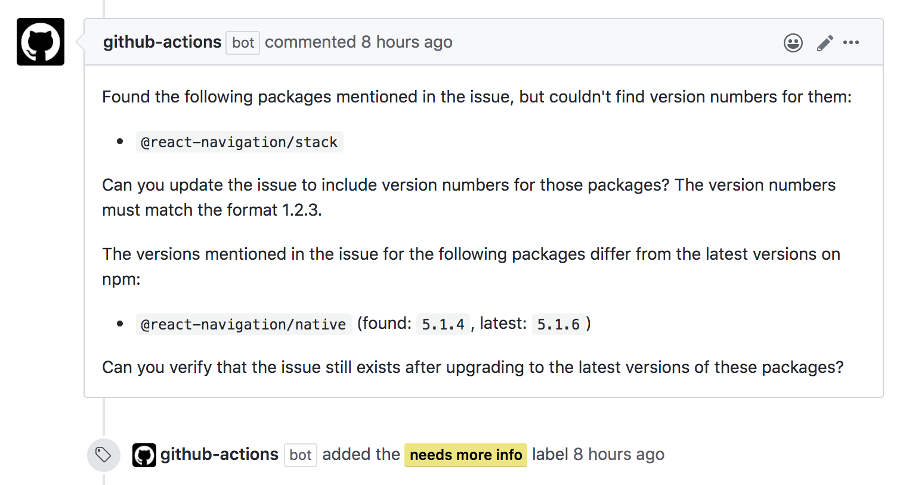

# Check versions action

This action checks for missing or outdated versions of packages mentioned in the issue.

## How it works

The action will check the issue content for name of packages and try to extract the version numbers. If some of the packages are missing version numbers or don't match the latest version numbers on npm, then it'll comment on the issue.



## Installation

Create a new workflow file (e.g. `.github/workflows/check-versions.yml`) and add the following configuration:

```yml
name: Check versions
on:
  issues:
    types: [opened]

jobs:
  check-versions:
    runs-on: ubuntu-latest
    steps:
      - uses: react-navigation/check-versions-action@v1.0.0
        with:
          github-token: ${{ secrets.GITHUB_TOKEN }}
          required-packages: |
            @react-navigation/native
          optional-packages: |
            @react-navigation/bottom-tabs
            @react-navigation/drawer
            @react-navigation/stack
          missing-versions-label: 'needs more info'
```

Make sure to change the `packages` list and the `missing-versions-label`.

## Inputs

### `github-token` (`required`)

The `GITHUB_TOKEN` secret. This is needed so that we can post comments on the issue.

### `required-packages`

List of required packages to check for. The action will match the content of the issue against these package names to find mentioned versions. If the packages are not mentioned or their version is not mentioned in the issue, the action will mark them as missing.

### `optional-packages`

List of optional packages to check for. The action will match the content of the issue against these package names to find mentioned versions. If there are packages present in the issue, but not mentioned in this list, then they will be ignored.

### `comment`

Boolean to indicate whether the action should comment on the issue on finding missing or outdated versions. Defaults to `true`.

Set it to `false` if you want to use the action as a filter.

### `missing-versions-label`

Label to add when missing or outdated versions are found.

## Outputs

### `found`

Packages and version numbers found. It'll be formatted like `@react-navigation/stack@5.1.2,@react-navigation/native@5.0.5`.

### `outdated`

Packages with outdated versions and their latest versions. It'll be formatted like `@react-navigation/stack@5.1.2,@react-navigation/native@5.0.5`.

### `missing`

Packages missing version numbers. It'll be formatted like `@react-navigation/stack,@react-navigation/native`.
